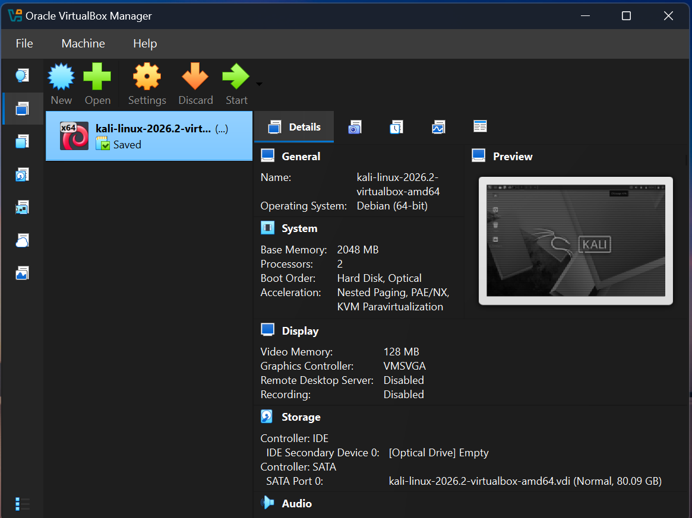

# 🛡️ Cybersecurity Lab Setup: VirtualBox & Kali Linux

## 📝 Project Overview
This repository details the foundational attack laboratory configured for the Networkwalks Cybersecurity Internship. It serves as a secure, isolated environment for penetration testing, network analysis, and vulnerability assessment, bridging practical ethical hacking techniques with advanced concepts in Cryptography and Information Security.

## 🛠️ Architecture & Network Design
The environment relies on a custom NAT Network to isolate traffic during security operations while maintaining internet connectivity for the attacker machine.
* **Hypervisor:** Oracle VirtualBox
* **Attacker OS:** Kali Linux 2026.2 (amd64)
* **Subnet:** `10.0.0.0/24`
* **Attacker IP:** `10.0.0.2` (Static)

---

## 🚀 Configuration Steps

### 1. Global NAT Network Setup
A dedicated NAT Network was established to host the attacker machine and future vulnerable targets on the same local subnet.
* **Name:** `NatNetwork`
* **IPv4 Prefix:** `10.0.0.0/24` with DHCP enabled.

> [📸 **Configuration:**] (Nat.png)

### 2. Kali Linux VM Parameters
The pre-built Kali Linux virtual appliance was imported and optimized for performance, seamless host interaction, and network visibility:
* **System & Acceleration:** Allocated 2048 MB of RAM with hardware virtualization (Nested Paging) enabled to ensure smooth execution of heavy cryptographic and security tools.
* **Network Adapter:** Attached to `NatNetwork` with Promiscuous Mode set to `Allow All` for deep packet inspection and network sniffing.
* **Shared Folders:** Configured a bidirectional auto-mounted folder to the host's `Downloads` directory for efficient file transfers.

> [📸 **System Settings:**](kaliconfig2.png) & 
> [📸 **Network Adapter:**](kaliconfig1.png)
> [📸 **Host Integration:**](kaliconfig4.png)

### 3. Internal IP Configuration
Inside the Kali OS, the network interface was configured to maintain a persistent static IP, ensuring reliable connectivity to the gateway. 
* **IP Address:** `10.0.0.2`
* **Netmask:** `24`
* **Gateway:** `10.0.0.1`
* **DNS:** `8.8.8.8`

> [📸 **Kali Network Manager:**](Interkali.jpg)

### 4. Baseline Snapshot & Deployment
After successfully configuring the network and resolving VirtualBox NAT routing limitations by executing a clean re-import, the machine (`my noussakali`) is fully operational. A clean baseline snapshot was taken to allow instant restoration during destructive testing scenarios.

> [📸 **Running State:**](snapshot.png)
 ## 🎯 Purpose of the Lab
The primary goal of this laboratory is to establish a secure, localized sandbox environment. This setup allows for the safe execution of penetration testing tools, malware analysis, and network scanning without risking exposure or interference with the physical host machine or the external local area network (LAN).

## ✅ Objectives
* Deploy a Type-2 Hypervisor (VirtualBox) for virtualization.
* Import and configure a pre-built Kali Linux virtual machine.
* Design an isolated `NAT Network` with a dedicated subnet (`10.0.0.0/24`).
* Assign and enforce a static IP address (`10.0.0.2`) for the attacker machine.
* Troubleshoot and validate both internal gateway communication and external WAN (Internet) access.

## 🔍 Lab Verification
To confirm the environment was fully operational, the following connectivity tests were executed via the Kali Linux terminal:
1. **Local Gateway Connectivity:** `ping -c 4 10.0.0.1` (0% packet loss) - Confirmed connection to the VirtualBox NAT router.
2. **DNS Resolution & WAN Access:** `ping -c 4 google.com` - Confirmed outbound internet access required for downloading external packages and updates.

## ⚠️ Problems Encountered & Solutions
* **Issue:** The Kali Linux machine had no external internet connection (DNS resolution failures and "Destination Host Unreachable" errors), even though the internal NAT Network was properly configured with the correct static IP (`10.0.0.2`) and gateway (`10.0.0.1`).
* **Troubleshooting Steps:** I initially executed the troubleshooting commands provided in the official Lab Setup manual (such as adjusting network manager settings and changing the DNS server), but these did not resolve the problem. I also verified the routing tables and interface statuses using `nmcli`.
* **Solution:** Concluding that the issue was a bug within VirtualBox's initial handling of the VM import and NAT network binding, the definitive solution was to **completely delete the virtual machine from VirtualBox and re-import the Kali Linux appliance from scratch**. After re-adding the machine and reapplying the setup, the internet connection and NAT routing worked flawlessly.

## 🧠 What I Learned
* **Advanced Virtualization Networking:** Deepened my understanding of how hypervisors handle NAT, bridging, and internal routing.
* **Linux Network Management:** Gained hands-on experience using the `nmcli` (NetworkManager Command Line Interface) utility to manipulate interfaces, gateways, and DNS settings directly from the terminal.
* **Systematic Troubleshooting:** Improved my methodology for diagnosing network blocks by isolating layers (Local IP -> Gateway -> DNS -> External IP).

## 🧰 Tools & Resources
* **Hypervisor:** [Oracle VM VirtualBox](https://www.virtualbox.org/) (v7+)
* **OS:** [Kali Linux](https://www.kali.org/) (2026.2 VirtualBox amd64 Image)
* **Archive Utility:** [7-Zip]( https://7-zip.org/download.html)
* **Curriculum:** [Networkwalks Cybersecurity Internship Lab Manual](https://networkwalks.com/)

---

## 👨‍💻 Author
**Noussaiba Aouad**  
*Master's Student in Cryptography and Information Security | Université Mohammed V*  
Passionate about ethical hacking, network analysis, and cryptographic algorithm implementations.
[MY LinkedIn](www.linkedin.com/in/noussaiba-aouad-886836316)
